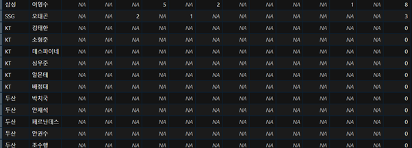

# 텍스트 마이닝으로 보는 2021 KBO 리그 결산

# 개요

과장 없이, 한국 프로야구는 국내 프로 리그 중 가장 규모가 크고 주목을 많이 받는 리그이다. 리그 내에서 수 백억의 돈이 오가며, 직접적으로 고용하는 인원만 천 명을 가뿐히 넘는다. 시즌 중에는 수 만명의 팬들이 경기를 시청하며 수백건의 기사가 날마다 업로드 된다. 2022 시즌 개막을 앞둔 현 시점에서, 2021 시즌 KBO 리그의 트렌드, 사건 사고를 명사 “버즈량”을 통해 분석하여, 다가오는 시즌에 어떠한 이슈들이 가장 주목을 받을지 예상해보는 프로젝트를 진행해보고자한다.

명사 버즈량은 2021년 1월 1일에서 2021년 12월 31일까지 네이버 스포츠 국내야구 뉴스 섹션에 기고된 모든 기사의 제목, 본문에서 명사들을 추출하여 집계한다. 명사 추출이 완료되면 가장 많이 언급이 된 명사, 선수 별 언급 횟수, 팀 별 언급 횟수 등의 테마를 기반으로 2021년 KBO 리그 트렌드를 분석할 것이다.

# 계획 수립

목표에 도달하기 위해선 크게 세 가지 과정을 이행해야한다.

1.    원자료 수집

2.    원자료 가공

3.    원자료 분석

본 프로젝트의 원자료는 2021년에 작성된, 네이버 스포츠 국내야구 뉴스 섹션에 기고된 모든 기사의 텍스트라 정의한다.

1번 단계를 완료하기 위해서는 파이썬 셀레니움을 이용하여 모든 기사를 크롤링할 예정이다.

2번 단계는 텍스트 마이닝 영역으로, 원자료의 텍스트를 분석에 적합한 형태로 변형한 뒤 명사를 토큰화하여 추출하는 것이다. 이를 위해 파이썬의 konlpy 패키지 내에 형태소 분석기 중 하나를 사용할 예정이다.

3번 단계는 각 기사에서 추출된 명사를 정리하여 인사이트를 생성하는 것이다. 이를 위해 R과 태블로의 다양한 분석 패키지와 시각화 기술을 사용할 예정이다.

## 계획 이행 과정

**1.    원자료 수집**

크롤링을 진행하기 위해서는 원자료가 담긴 링크를 먼저 해부해야 한다. [https://sports.news.naver.com/kbaseball/news/index?date=20210101&isphoto=N&page=1](https://sports.news.naver.com/kbaseball/news/index?date=20210101&isphoto=N&page=1)

위 링크에서 날짜와 페이지 번호에 해당되는 변수를 변경하여 2021년 12월 31일의 마지막 기사 페이지의 마지막 기사까지 크롤링을 하는 코드를 구성해야한다. 조금 더 이해하기 쉽게 실제 크롤링 과정을 단계로써 풀어 써보도록 하겠다.

1.    셀레니움의 크롬 웹드라이버 상에서 2021년 XX월 XX일 (날짜 변수) 1페이지 접속

2.    해당 페이지에 업로드 된 모든 기사의 제목과 본문을 크롤링하고 저장

3.    다음 페이지로 이동 후 2번 코드를 실행

4.    3번 코드를 마지막 페이지에 도달할 때 까지 반복하여 실행

5.    1번 코드의 저장된 날짜에서 하루를 추가하고

6.    1에서 5번 코드를 날짜 변수가 2021년 12월 31일에 도달할 때 까지 반복하여 실행.

7.     1~6번 코드에서 생성된 데이터 저장

코드를 구현한 뒤에 루프를 작동하는 것에는 큰 문제가 없었으나, 삭제된 기사가 중간중간에 있어 오류가 종종 발생하였다. 비시즌에 속하는 달에는 기사량이 비교적 적어 월별 크롤링에 약 1시간 정도 소요됐다. 시즌이 진행 중인 달에는 기사량이 증가하여 월별 크롤링에 약 2시간 이상 소요됐다.

크롤링 결과, 총 105,189건의 기사 제목, 본문이 크롤링되었다. 크롤링의 결과가 저장된 데이터 프레임을 최초에는 csv 파일로 저장했으나, 파일의 크기나 너무 방대 (1.6 GB)하고 로드가 느리다는 치명적인 단점을 발견하였다. 따라서, 데이터 프레임을 pickle 파일로 저장하였고, 파일의 크기는 (827MB)로 감소, 로딩 시간도 크게 개선되었다.

**2.    원자료 가공**

파이썬에는 다양한 형태소 분석기가 있다. 한글 형태소 분석기 중에서는 konlpy가 작동이 편리하고 접근성이 높기 때문에 널리 애용되고 있다. Konlpy 내에서도 각자 다른 기능과 사전을 제공하는 패키지로 나뉘어 있다. 그 중 Mecab, Okt, Kkma가 뛰어난 분석, 사전기능을 자랑하고 있는데, 각각의 분석기마다 다른 장단점이 존재한다. Mecab은 띄어쓰기 오류를 보정하여 분석하는 기능이 뛰어나며, 비교적 속도도 빠르다. Kkma 역시 띄어쓰기 오류에 덜 민감하지만, 속도가 느리고 정제되지 않은 언어 (비속어, 신조어 등)에 대해 분석력이 높지 않다. Okt는 띄어쓰기 오류에 덜 민감하면서, 인터넷 용어를 포함하는 사전을 사용하기 때문에 정제되지 않은 언어에 대한 분석력이 뛰어나다.

1번 단계에서 취득한 기사들은, 대다수가 문법, 띄어쓰기 규칙을 준수해야 하는 원칙하에 작성이 되었기 때문에 띄어쓰기 오류에 대해서는 크게 걱정할 필요가 없다. 다만, 유행어, 신조어, 전문 야구 용어 등이 대거 포함되어 있기 때문에 정제되지 않은 언어에 강점이 있는 Okt 분석기를 사용하기로 결정하였다.

텍스트 마이닝 단계에선 구체적으로 다음과 같은 코드를 실행하였다.

1.    기사의 제목과 본문을 결합한 corpus 생성

2.    Corpus에 워드 클렌징 작업 진행 (불용어 제거, “\n”, “영문 텍스트 제외”)

3.    Okt 패키지의 noun 함수를 이용하여 각 기사 corpus에서 언급된 명사 추출.

4.    1에서 3번 코드를 원자료 안에 있는 모든 기사에 대해 적용

데이터 양이 방대하다보니, 위 코드를 완료하기까지 2시간 가량 소요됐다. 추출 결과는 기대 이상으로 분석이 잘 이루어졌다. 대부분의 야구 선수들의 이름이 이미 okt 사전에 등록되어 있어 명사로써 잘 추출이 됐다. 그러나, 한 글자 단위의 명사들은 본래의 의미를 이해하기 어렵기 때문에 제거하였다.

**3.    원자료 분석**

명사 구분이 완료된 자료를 다시 pickle 파일로 저장한 뒤 R Studio에 로드하였다. 텍스트에 대해서는 이전 단계에서 가공이 되었기 때문에 본격적으로 데이터를 요약하는 과정에 돌입하였고, 취득한 데이터 셋은 다음과 같다.

전처리와 분석을 거쳐 구한 데이터 셋

1.    월별 야구 기사 개수

2.    요일별 기사 개수

3.    요일별 가장 많이 등장한 단어

4.    단어별 기사 언급 총합계

5.    월별 가장 많이 등장한 단어

6.    2021년 기사 제목, 본문 내에서 팀 언급 횟수 (중복 포함; 한 기사에서 특정 팀이 여러 번 반복된 경우도 인정)

7.    기사 제목, 본문 내에서 가장 많이 언급된 단어

8.    선수,월별 기사 언급 빈도수 (중복 X 한 기사에서 여러번 언급되어도 한 번 카운트)

9.    2021년 선수 언급 횟수 순위

10.  소속팀별 소속 선수 언급 횟수 총합 순위+시즌 중 언급 비율(소속팀 별로 속한 선수가 각 기사에서 한 번 이상 언급된 횟수 총합)

11.  팀, 월별 기사 언급 빈도수 (중복 X 한 기사에서 여러번 언급되어도 한 번 카운트)

12.  정용진 언급 빈도

## 계획 변경 사항

● 선수 이름 빈도수를 구하기 위해서는 KBO 리그에 속한 선수 리스트가 필요했다. 이는 KBO 공식 홈페이지에서 KBO리그 개막전, 정규시즌 마지막 날에 등록된 선수들의 소속팀과 이름을 크롤링하여 구성하였다. 그러나, 개막, 마지막 날에 등록되어 있지 않은 선수들 중 굵직한 선수는 (부상으로 인해 해당 시기 제외 됐던 경우, 대체 외인 등) 수작업으로 추가해주었다. 그 뒤, 105,189건의 기사에서 추출된 명사 리스트 중, 각 선수의 이름이 언급된 횟수를 집계하였다.

● 그러나, 위 선수 리스트를 이용하여 이름 빈도수를 구한 결과가 부정확한 부분이 있었다. 일부 신인급, 외국인 선수는 기존 okt 명사 사전에 등록이 되어 있지 않았다 (이의리, 소형준, 원태인 등등) 따라서, 사전에 등록되지 않은 선수들의 언급 빈도수가 결측 처리되어 있었으며, 사용자 사전 추가로 명사를 등록하여 다시 토큰화를 진행해야 했다.

● Okt 사용자 사전에 누락된 선수의 이름을 명사 리스트에 추가한 뒤 (Okt 사용자 사전 단어 추가 방법은 부록을 참고) 텍스트 클렌징, 명사 추출, 데이터 분석 과정을 다시 반복하였다. 그러나, 데이터 분석 과정 중 선수명, 팀 명 언급 빈도 집계하는 작업에서 R이 원인을 알 수 없는 속도 저하를 보였다. 사용자 사전에 이름을 추가하기 전에도 다소 속도가 느린 편이었지만 (대략 5분 소요), 이번에는 9시간이 지날 동안 작업의 절반도 끝내지 못했다. 따라서, 데이터 분석 역시 파이썬에서 진행해주었다.

● 동명이인에 경우에는 한 선수가 압도적으로 유명한 경우에는 분간하기 어렵지 않으나, 선수중 여럿이 유명한 경우에는 분간하기 쉽지 않다 e.g 최원준 김민수 이병규 등 따라서, 동명이인 선수에 대해서는 별도의 확인이 필요하다.

## 결과 분석

### 월별 선수 이름 언급 빈도 데이터 해석&인사이트

최종 결과물 열람: [https://public.tableau.com/app/profile/.25246435/viz/_16448080131560/sheet5](https://public.tableau.com/app/profile/.25246435/viz/_16448080131560/sheet5)

## **총합 언급빈도 TOP 5 선수 분석**

<aside>
💡 TOP 1 이정후

</aside>

대망의 1위 자리에는 키움 히어로즈의 외야수, 이정후가 이름을 올렸다. 이정후는 매월 꾸준한 언급빈도를 유지하면서 높은 언론 보도 횟수를 기록하였다. 비시즌 언급 빈도는 다른 선수들에 비해 약간 높은 정도이다. 리그를 대표하는 슈퍼스타인만큼, 기자들의 취재 횟수나 기록을 나열하는 과정에서 언급되었을 가능성이 높다.

이정후의 언급 빈도는 꾸준히 우상향의 트렌드를 보이다 9월의 첫날에 부상을 당하며 언급량이 급하락했다. 그 이후 키움이 가을야구 경쟁을 치열하게 이어가던 10월에 복귀하여 다시 평균 수준의 언급빈도를 회복하다, 11월 3일 와일드카드 2차전을 끝으로 시즌을 마치자 언급빈도가 하락하였다.

<aside>
💡 TOP 2 강백호

</aside>

2위 자리에는 강백호가 이름을 올렸다. 올시즌 MVP급 활약을 보인 강백호의 언급빈도는 이정후의 언급빈도 트랜드와 일치한다. 강백호의 경우, 올림픽 야구 경기가 진행된 8월에 이정후보다 매우 높은 언급 빈도를 기록하였다. 강백호 역시 9월에 이전 달에 비해 언급 빈도가 크게 하락했지만, 이정후와 달리 평균치보다 오히려 높은 수준의 기록을 보였다. 즉, 11월까지 강백호의 기록은 꾸준한 우상향의 트랜드를 보이며, 8월달의 기록이 오히려 이상치라 볼 수 있는 것이다. 괄목할만한 점은, 8월부터 강백호가 이정후보다 검색빈도에서 앞서기 시작했는데, 이는 시즌 끝까지 역대급 1위 경쟁을 이어간 소속팀의 미디어 집중도가 큰 영향을 끼친 것이다. 관심이 집중되는 한국시리즈에서 맹활약한 영향으로 강백호는 11월에도 매우 높은 수치를 기록하였다. 강백호의 비시즌 언급 비율과 합계는 이정후의 수치보다 낮지만, 유의미한 차이로 보이지는 않는다.

<aside>
💡 TOP 3 추신수

</aside>

3위에는 오랜 메이저리그 생활을 끝마치고 KBO로 온 추신수가 이름을 올렸다. 거취가 불분명했던 추신수는 1월 야구 기사에는 이름을 한 번도 올리지 않았다. 그러다, 2월의 마지막 주 23일에 아무런 예고 없이 새로 야구단을 인수한 SSG와 계약 소식을 알린다. 단 6일만에 무려 758건의 기사에서 추신수의 이름이 언급되었으며, 말 그대로 모든 주목을 받게 되었다. 2월 언급빈도 2위의 수치가 홍원기 감독의 400건이라는 점을 감안하면, 6일만에 기록한 758건의 언급 빈도는 엄청난 것이라 볼 수 있다. 추신수가 한국에 입국하고 스프링캠프, 시범경기를 치루는 2월에만 언급빈도가 폭발적으로 증가하여 무려 2,412건을 기록하였다. 이는 쿠에바스, 한동희가 1년 동안 기록한 언급빈도와 같다. 시즌이 개막한 4월에도 추신수는 이슈의 중심에 서서 높은 언급 빈도를 기록했다. 그러나 5월부터는 점차 하락하기 시작하면서 10월에 잠시 반등을 한 후에는 계속 하향세를 보였다(물론 5월 이후에 기록한 기록 빈도 역시 리그 내에서는 상위권 수준의 기록이다).

추신수의 자료로부터 유추할 수 있는 점은, 네임드급 선수가 이적, 데뷔를 하면 대략 2달~3달 정도 관심도가 높게 유지된 뒤 하락한다는 점이다. 실제로, 추신수가 처음 영입됐을땐 단순 훈련하는 모습마저도 큰 관심을 끌며 많은 기사가 생산되었다. 하지만, 시즌이 진행되면서 추신수의 존재가 익숙해짐에 따라 언급빈도가 자연스레 하락한 것으로 이해할 수 있다. 향후 추가 연구를 진행한다면, 대어급 외국인 용병이 영입됐을 때 앞서 언급한대로 언급 빈도 트랜드가 변동되는지 확인해보면 좋을 것 같다.

<aside>
💡 TOP 4 김현수

</aside>

4위는 LG 트윈스의 김현수다. 사실 앞선 선수와 다르게, 김현수는 KIA 타이거즈 투수 김현수와 동명이인이기 때문에 언급 빈도가 실제보다 더 높게 나온다. 하지만, 투수 김현수가 신인급 선수이고 올시즌 1군에선 17경기 45.2이닝 밖에 소화하지 않았기 때문에 실제 수치에 큰 영향은 주지 않았을 것으로 판단한다.

김현수는 시즌 중에는 평균적으로 600건 정도의 언급 횟수를 기록했다. 국가대표로 차출되어 올림픽 경기에서 활약한 8월에는 수치가 급상승하였다. 8월 한 달에만 무려 16,00건에 달하는 수치를 기록했는데, 이는 강백호에 이은 8월 2위에 해당하는 수치이다. 팀의 캡틴이자 리그를 대표하는 타자이기 때문에, 미디어에 꾸준하게, 많이 노출되었고 그 결과 2021년 리그에서 네번째로 가장 많이 언급이 된 선수가 되었다.

김현수는 시즌 중에는 평균적으로 600건 정도의 언급 횟수를 기록했다. 국가대표로 차출되어 올림픽 경기에서 활약한 8월에는 수치가 급상승하였다. 8월 한 달에만 무려 16,00건에 달하는 수치를 기록했는데, 이는 강백호에 이은 8월 2위에 해당하는 수치이다. 팀의 캡틴이자 리그를 대표하는 타자이기 때문에, 미디어에 꾸준하게, 많이 노출되었고 그 결과 2021년 리그에서 네번째로 가장 많이 언급이 된 선수가 되었다.

<aside>
💡 TOP 5 이의리

</aside>

5위는 2021년 KBO 리그 신인왕을 수상한 KIA 타이거즈의 이의리다. 고졸 신인인 이의리는 사실 시즌 시작 전부터 기대를 한 몸에 받은 선수다. 1차 지명, 계약금 3억원, 고교 수준에서도 뛰어난 활약을 보여줬다. 3월에 이미 576건의 언급, 전체 4위를 기록할 정도로 데뷔 전부터 큰 관심을 받은 선수다. 그리고, 데뷔 직후부터 뛰어난 활약을 보인 이의리는 4월부터 8월까지 꾸준히 미디어에 노출되었다. 특히, 올림픽 경기에 출전한 8월에는 1,123건의 언급빈도를 기록했을정도로 야구팬들이 관심을 가졌다. 불행하게도, 올림픽에서 복귀한 후 얼마 지나지 않아 부상을 당하며 9,10,11월에 언급빈도가 크게 감소했다. 후반기에 부상을 당해 정기적으로 등판을 하지 못했음에도 2021년 언급빈도 5위를 기록한 것은, 이의리가 신인 시즌부터 높은 미디어 노출도를 기록했음을 증명한다.

## ***선수 이름 언급빈도로 본 월별 이슈***

## 1월

FA 이적생, 예비 FA선수들의 이름이 눈에 띈다. FA를 앞둔 손아섭은 롯데와 맺은 1차 계약에서 마지막 해 연봉을 의도적으로 적게 책정한 것이 밝혀지며 기자들이 이적 가능성을 조명했다. 사실상 마지막 FA 자격을 얻은 이대호는 1월 29일 롯데와 2년 재계약을 발표했다. 이외에도 나성범, 박건우, 박병호, 김현수 등 2021 시즌이 끝나고 FA자격을 얻는 선수들의 이름이 자주 언급이 되었다. 이중 주목할 이름은 이학주와 주권이다. 이학주는 2021시즌 이전부터 트레이드 블록에 올라 야구팬들의 많은 관심을 끌었는데, 특별한 사건사고 없이도 순위관에 오른 것은 매우 이례적이다. 주권은 몇 년만에 처음으로 연봉조정신청을 하여 큰 이슈몰이를 했다.

## 2월

2월에도 FA 계약과 연관된 선수들이 순위권에 많이 올랐지만, 1월보다는 다가오는 시즌에 대한 기대감에 많이 엿보이는 기사가 작성됐다. 2월 순위권에는 각 구단의 감독들의 이름이 많이 올라와있는데, 이는 스프링 캠프를 진행하며 감독의 전술과 전략을 소개하는 비시즌의 야구 기사들의 특성을 반영한다. 명불허전의 추신수가 압도적인 1위를 기록했고 비교적 좋은 커리어를 쌓고 LG로 이적한 수아레즈의 이름이 눈에 띈다.

## 3월

3월에는 스프링캠프에서 좋은 기량 발전을 보인 선수들, 시범경기에서 좋은 결과를 보인 선수들이 많이 주목을 받는 시기다. 여전히 이적생들과 감독이 이름이 순위권에 많이 포진해있고, 장재영, 김헌곤 같은 팬들이 높은 기대치를 가지고 있는 선수들 역시 포함되어 있다.

## 4/5/6월

4,5,6월에는본격적으로 시즌이 시작되면서 좋은 활약을 보인 선수들에게 기사가 집중되는 시기이다. 이정후, 강백호, 피렐라, 홍창기, 유강남, 원태인, 채은성, 최정 등 시즌 초반에 좋은 기록을 낸 선수들이 순위권에 이름을 올렸다.

## 7월

반면, 7월에는 올림픽과 관련된 선수들이 주목을 받았다.

시즌 내내 높은 언급빈도를 기록한 선수들도 있지만, 올림픽 출전 효과로 반사이익을 누린 선수들이 여럿 보인다. 대표적으로, 올림픽에 차출된 원태인, 김민우, 김혜성, 강민호, 오승환은 연간 언급빈도 총합 순위는 모두 23위보다 낮지만, 7월에 한정해서는 언급빈도가 급상승했다.

반면, 부정적인 방향으로 관심을 끈 선수들도 있다. 방역수칙 위반으로 징계를 받은 박민우, 한현의, 박석민, 이명기가 순위권에 이름을 올렸다.

## 9/10월

순위 경쟁이 절정에 달하는 9,10월에는 팀의 활약이 크게 조명을 받는 시기이다. 좋은 성적을 내는 선수일지라도, 순위경쟁과 동떨어진 선수들은 그리 많은 언급을 받지 못했다. 반면, 순위 경쟁권 팀에서 좋은 활약을 한 선수들은 집중적으로 언급이 됐다.

## 11월

11월에는 가을야구가 진행됐다. 시리즈별 플레이하는 두 팀만 조명을 받는 가을야구 특성상, 시리즈에서 좋은 활약을 펼친 선수들 위주로 언급이 되었다. 가을 DNA를 증명한 두산의 선수들이 순위권의 절반을 차지했고 KT 소속 선수들도 여럿 보인다. 반면, 가을야구에 참가한 LG는 감독인 류지현 외에는 선수들이 단 한 명도 순위권에 오르지 못했다. 그만큼 LG 투수, 타자들이 기자들이 관심을 가지지 않을, 밋밋한 활약을 했다는 증거가 아닐까 싶다. 11월에는 집중적으로 포스트시즌에서 플레이 하는 팀의 선수들에 대한 기사를 작성할 수 밖에 없다. 따라서, 팬 입장에서는 가을야구에서 잘하는 선수들의 이름을 많이 접할 가능성이 높기 때문에 평가가 높아질 수 밖에 없다.

## 12월

시즌이 끝난 12월에는 시상식과 FA 이적이 있다. 이를 반영하듯, 12월 언급 빈도 TOP20 리스트에는 주요 상 수상 가능성이 높은 선수들과 FA 자격을 얻은 선수들이 포함되었다. 특히, 나성범은 골든글러브 유력 후보로 꼽히면서 FA 계약을 맺는 과정에서 파격적인 선 공개 후 계약 행보를 보여주면서 큰 관심을 끌었다.

---

# 결과 분석

## 월별 팀명 언급 빈도 데이터 해석&인사이트

팀명 언급 빈도의 경우, 시즌 성적과 팀 인기도를 주요 영향 요인으로 꼽을 수 있다. 전통적으로 미디어의 주목을 많이 받는 LG가 좋은 팀 성적 (정규시즌 3위)에 힘입어 언급 빈도 총합 1위의 자리에 올랐다. 키움의 경우, 야구팬들은 주요 미디어들에 소외되었다 생각하는 경우도 많지만, 되려 언급 빈도 총합 3위 자리에 올랐다. 반면, 팬이 가장 많다고 알려진 KIA는 좋지 못한 시즌 성적의 영향으로 생각보다 낮은 언급 빈도 순위를 기록했다. 팀 매각 소식으로 야구계의 폭풍을 일으킨 SK의 팀명이 1,2,3월에 압도적인 수치로 1위를 기록했다.

각 팀의 모기업 명 언급빈도를 기준으로 조회해도 이전과 대동소이한 결과를 보인다. 오히려, KT의 순위가 크게 내려가게 된다. 1위를 달리던 후반기에도 언급빈도가 높지 않았다. 키움와 NC의 경우 불미스러운 사태가 발생한 7월에 압도적인 언급빈도 1,2위 자리에 올랐다. 한화는 정규시즌 10위 성적에도 불구 언급 빈도 자체는 5위를 기록하며 전통적인 미디어 강자의 면모를 증명하였다.

---

# 결론

선수 개인 단위에서는 좋은 성적은 높은 미디어 노출도로 이어졌다. 또한, 계절별로 확연하게 인기를 끄는 주제가 있는 것을 확인하였다.

*계절별 변동: 1~2월은 FA 이적생 중심. 3월은 신인, 스프링캠프에서 좋은 평가를 받은 선수. 정규시즌 초에서 중반까지는 좋은 활약을 보인 선수. 정규시즌 말과 포스트 시즌에는 순위 경쟁 팀 소속 중 좋은 활약을 보인 선수. 12월에는 예비 FA 선수, 주요 상 수상 유력 선수.*

팀 단위로는, 이슈의 중심이 되는 팀이 월마다 언급빈도가 평균보다 높게 찍히는 추세가 반영됐지만, 결국 언급빈도 총합은 팀 성적에 어느정도 수렴하는 것으로 분석할 수 있다.

띄어쓰기, 오타, 신조어, 토큰화 오류 등 명사 추출에 영향을 주는 요소가 너무나도 많다. 띄어쓰기나 신조어는 추가 패키지 사용, 사용자 사전 추가 등의 조치를 통해 개선이 가능하지만, 토큰화 오류의 경우에는 현재 가진 역량으론 마땅히 대처할 방법이 없었다. 특히, “가능”, “기능”, “시즌” 등의 명사 단위에선 의미를 파악하기 어렵지만 언급 빈도가 매우 높은 단어들을 분석하는 과정에 큰 난관이 있다. 데이터 클렌징 작업에 대한 추가적인 학습을 통해 명사 추출 단계의 정확도를 향상시키는 것을 목표로 설정하며 본 작업을 마친다.

---

# 부록

**Okt 사용자 사전 단어 추가 방법**

1.    프로젝트(혹은 가상환경)가 저장되어 있는 폴더 (C:\Users\***\PycharmProjects\Coupang\venv\Lib\site-packages\konlpy”로 간다.

2.    Open-korea-text-2.1.0을 압축해제한다.

3.    C:\Users\***\PycharmProjects\Coupang\venv\Lib\site-packages\konlpy\java\open-korean-text-2.1.0\org\openkoreantext\processor\util\noun 에서 적절한 사전을 클릭하여 원하는 단어를 추가한다.

4.    기존에 있던 Open-korea-text-2.1.0.jar 파일은 삭제하고, cmd창을 킨다.

5.    cd C:\Users\***\PycharmProjects\Coupang\venv\Lib\site-packages\konlpy\java\open-korea-text-2.1.0 (okt 폴더가 있는 경로)로 이동한다.

6.    jar cvf user.jar . 을 입력한다.

7.    user.jar을 C:\Users\***\PycharmProjects\Coupang\venv\Lib\site-packages\konlpy\java로 옮기고, jar 파일명을 open-korea-text-2.1.0으로 바꾼다.

8.    파이썬에 들어가 okt.noun 함수를 활용하여 추가한 명사가 제대로 토큰화가 이루어지는지 확인한다.

작성자: 한승헌
